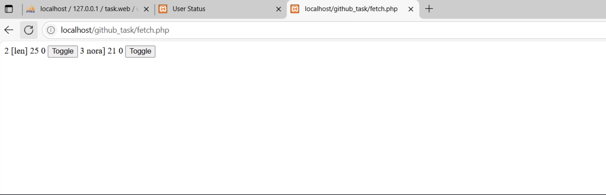
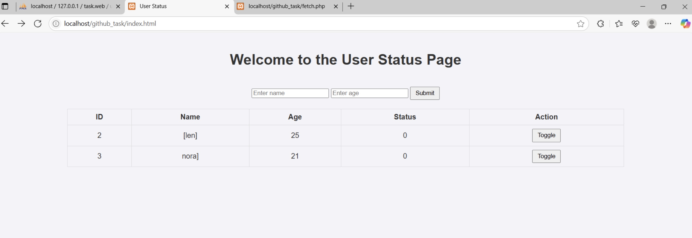

# 🗂️ User Status Management

## 1. Description
This project is a simple **PHP** and **MySQL** web application that allows users to:
-  **Add** new users to a database.
-  **Display** them in a table format.
-  **Toggle** their status between **0** (Inactive) and **1** (Active) using a button.

---

## 2. Setup

###  Install XAMPP
- 📥 Download and install **XAMPP** from the [official website](https://www.apachefriends.org/index.html).
- ▶️ Start **Apache** and **MySQL** from the XAMPP Control Panel.

---

### 3.  Create the Database
1. Open **phpMyAdmin**: [http://localhost/phpmyadmin/](http://localhost/phpmyadmin/)  
2. Create a new database called **`task_web`** *(or choose another name)*.  
3. Create a table named **`users`** with the following columns:

| Column  | Type      | Attributes                        |
|---------|-----------|-----------------------------------|
| `id`    | INT       | Primary Key, Auto Increment       |
| `name`  | VARCHAR   |                                   |
| `age`   | INT       |                                   |
| `status`| TINYINT   | 0 = Inactive, 1 = Active           |

---

### 4.  Set Up Project Files
- 📂 Place the project files in the **htdocs** directory:  
- 🛠 Make sure the database name in **`db.php`** matches the one you created:
```php
$dbname = "task_web";
```
### 5.  Run the Project
🌐 Open your browser and visit:
http://localhost/github_task/index.html
You can now:
➕ Add new users.
📋 View them in a table.
🔄 Toggle their status instantly.


## 6.  Files Overview 📂

| File Name     | Function                                    |
|---------------|---------------------------------------------|
| **`db.php`**      | Connects to the database.                  |
| **`fetch.php`**   | Fetches user data from the database.       |
| **`insert.php`**  | Adds new users to the database.            |
| **`fetch.js`**    | Dynamically loads data to the page.        |
| **`update.php`**  | Toggles the user status.                   |
| **`style.css`**   | Provides basic page styling.               |


## 7. Screenshots

| Example 1 | Example 2 |
|-----------|-----------|
|  |  |
